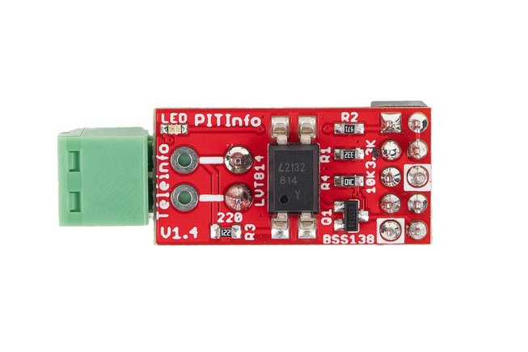

Lecture des informations de la TIC d'un compteur Linky avec un module PITInfo installé sur un Raspberry Pi Zéro W, et écriture des données dans InfluxDB.



Lancer.

```
nohup python linky-meas.py > linky-meas.log 2>&1 &
```

# Compteur Linky

[Source](https://www.hleroy.com/2023/02/recuperer-la-teleinformation-linky-depuis-un-raspberry-pi-avec-python-influxdb-et-grafana/)

On utilise les bornes de la Télé-Information Client (TIC) du compteur Linky situées sous le capot du compteur à gauche. Pour la transmission de données, il faut utiliser les deux bornes I1 et I2 situées à gauche.

Il y a deux modes de transmission sur la TIC, qui émettent à deux vitesses différentes.
- HISTORIQUE MODE TIC : 1200 bauds
- STANDARD MODE TIC : 9600 bauds

Le mode est configurable par le menu du compteur. 

# Raspberry Pi Zéro W

On connecte le Raspberry à la TIC du compteur avec le module PiTInfo (https://www.tindie.com/products/hallard/pitinfo/).

## Activation de la liaison série du Raspberry

Via raspi-config.

Ou en ajoutant dans /boot/config.txt.

```
enable_uart=1
```

Le UART sur le Raspberry apparaît sur /dev/ttyS0. S'ajouter au user group pour y accéder.

```
ls -l /dev/tty*
crw-rw----. 1 root dialout 188, 0 Jan 21 11:05 /dev/ttyS0
...
sudo usermod -a pi -G dialout
```
For the changes to take effect, log out from your user account and log in back again.

Puis lire ce qui arrive sur la liaison série avec picocom.

```
sudo picocom -b 1200 -d 7 -p e -f n /dev/ttyS0
Type [C-a] [C-h] to see available commands
Terminal ready
BASE 075550216 *
PTEC TH.. $
IINST 008 _
IMAX 090 H
PAPP 0
```

> L'affichage s'arrêtait après quelques trames. Une première piste a mis en doute l'utliisation du Mini UART (UART par défaut du Raspberrry) qui semble peu performant car synchronisé sur le CPU du Raspberry. Une tentative a été faite d'utiliser le PL011 UART à la place (https://di-marco.net/blog/it/2020-06-06-raspberry_pi_3_4_and_0_w_serial_port_usage/) sans succès. Il faut en fait supprimer "console=serial0,115200" dans /boot/cmdline.txt (https://spellfoundry.com/2016/05/29/configuring-gpio-serial-port-raspbian-jessie-including-pi-3-4/).
>
> ```
> console=serial0,115200 console=tty1 root=PARTUUID=d9cb61b9-02 rootfstype=ext4 fsck.repair=yes rootwait cfg80211.ieee80211_regdom=FR
> ```
>
> En
> 
> ```
> console=tty1 root=PARTUUID=d9cb61b9-02 rootfstype=ext4 fsck.repair=yes rootwait cfg80211.ieee80211_regdom=FR
> ```

## Informations en sortie de la TIC

En tarif base.

- ADCO : Adresse du compteur
- OPTARIF : Option tarifaire choisie
- ISOUSC : Intensité souscrite
- BASE : Index option Base
- PTEC : Période Tarifaire en cours
- IINST : Intensité Instantanée 
- IMAX : Intensité maximale appelée
- PAPP : Puissance apparente
- HHPHC : Horaire Heures Pleines Heures Creuses
- MOTDETAT : Mot d'état du compteur

# InfluxDB

```
pip install influxdb-client --break-system-packages
```


